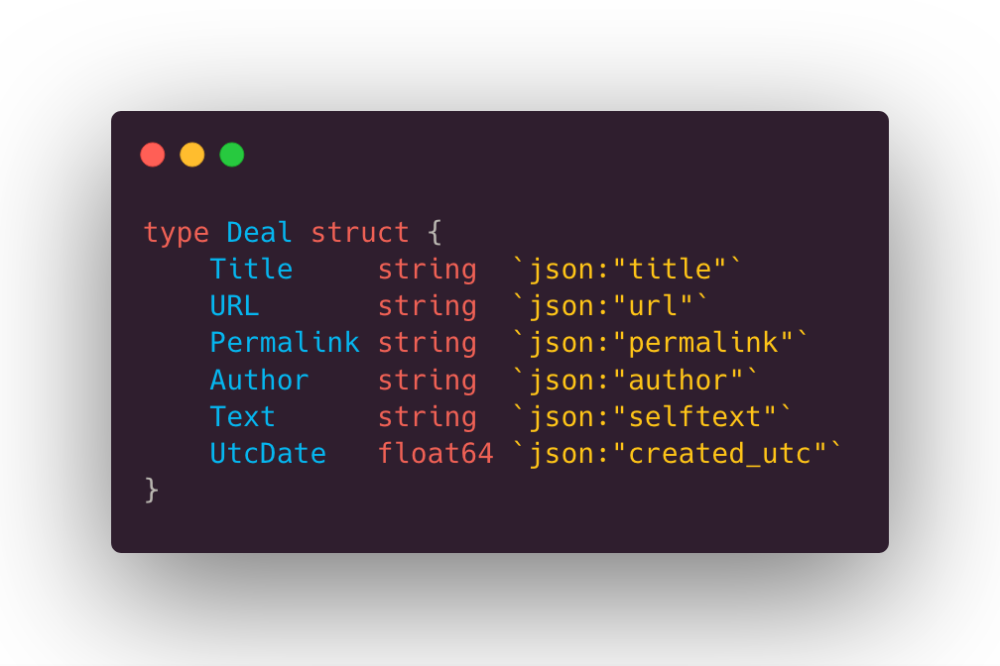

# Game Deals

**Game Deals** will be a _VueJS_ webapp, I will use this little app for learning
purposes.

## Description

**GameDeals** will help me to track interesting deals from **REDDIT API**
(Game Deals subreddit).  
This tiny web application will help me to learn the whole process of building
a web application.

### What I want to learn

- [ ] Golang
- [ ] VueJS
- [ ] Docker

## Backend

I decided to implement the backend using **Golang**, I really love this language,
The backend is made up aroud 2 packages

### Reddit Package

- **models.go**: contains the model, a struct named _Deals_ that represent a single deal. 
- **functions.go**: contains all the functions useful to retrieve data from reddit api and parse it

> Both of this will need a bit of refactoring,
> we are only at version one

### Server Package

- **routes.go**: contains all routes useful to serve the data

The API is build using the [Julien Smidth's router](https://github.com/julienschmidt/httprouter)

## Frontend